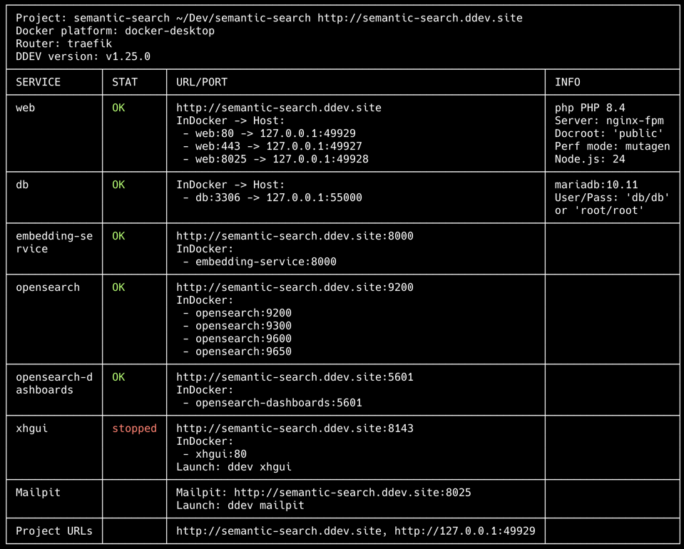

# Semantic Product Search with Pimcore and OpenSearch

This project demonstrates an AI-driven semantic search experience for dataobjects in Pimcore using 
k-nearest neighbor search in OpenSearch.

<!-- TOC -->
* [Semantic Product Search with Pimcore and OpenSearch](#semantic-product-search-with-pimcore-and-opensearch)
  * [🚀 Features](#-features)
  * [🛠 Tech Stack](#-tech-stack)
  * [📋 Pre-requisites](#-pre-requisites)
    * [Git](#git)
    * [Docker](#docker)
    * [DDEV](#ddev)
  * [📦 Installation for local development](#-installation-for-local-development)
    * [Step 1: Get the project files](#step-1-get-the-project-files)
    * [Step 2: Setup the development environment](#step-2-setup-the-development-environment)
    * [Step 3: Install Pimcore](#step-3-install-pimcore)
    * [Step 4: Start the message queue worker](#step-4-start-the-message-queue-worker)
    * [Step 5: Configure OpenSearch](#step-5-configure-opensearch)
    * [Step 6: Install the demo data](#step-6-install-the-demo-data)
    * [Step 7: Open the web UI](#step-7-open-the-web-ui)
  * [🌐 Try it out](#-try-it-out)
<!-- TOC -->

## 🚀 Features

- **k-NN Search:** embedding-driven search for products in OpenSearch
- **automatic indexing:** automatic product indexing on product creation, update and deletion
- **Web UI:** a simple web UI for querying and exploring the search results

## 🛠 Tech Stack

- **Framework:** [Pimcore](https://pimcore.com/)
- **Search Engine:** [OpenSearch](https://opensearch.org/)
- **Search Engine Abstraction:** [SEAL](https://php-cmsig.github.io/search/)
- **Embedding:** [paraphrase-MiniLM-L12-v2](https://huggingface.co/sentence-transformers/paraphrase-MiniLM-L12-v2)
- **Development environment:** [DDEV](https://ddev.com/)

## 📋 Pre-requisites

**Software requirements:**
- Git
- Docker
- DDEV

### Git

Check if git is installed by running:
```bash
git --version
```
If not, follow the installation instructions on the git website:
- [Windows](https://git-scm.com/download/win)
- [Mac](https://git-scm.com/download/mac)
- [Linux](https://git-scm.com/download/linux)

### Docker

Check if docker is installed by running:
```bash
docker --version
```
The output should contain the version number of docker. If not, follow the installation instructions on the docker website:
- [Windows](https://docs.docker.com/desktop/setup/install/windows-install/)
- [Mac](https://docs.docker.com/desktop/mac/install/)
- [Linux](https://docs.docker.com/engine/install/)

Check if the docker daemon is running:
```bash
docker info
```
If the output contains an error, start the docker daemon by running the "docker desktop" application. 
> On MacOS you can simply run `open -a Docker`

### DDEV

Check if ddev is installed by running:
```bash
ddev --version
```
The output should contain the version number of ddev. If not, follow the installation instructions on the ddev website:
- [Mac](https://docs.ddev.com/en/stable/users/install/ddev-installation/#mac)
- [Windows](https://docs.ddev.com/en/stable/users/install/ddev-installation/#windows)
- [Linux](https://docs.ddev.com/en/stable/users/install/ddev-installation/#linux)

## 📦 Installation for local development

### Step 1: Get the project files

Clone the repository:
```bash
git clone https://github.com/c0lider/semantic-search.git
```

Navigate to the project directory:
```bash
cd semantic-search
```

### Step 2: Setup the development environment

Start the development environment with DDEV:
```bash
ddev start
```

Verify ddev is running correctly by executing the following command:
```bash
ddev describe
```

The output should look similar to the following screenshot:


Install php dependencies:
```bash
ddev composer install --no-scripts
```

Install node dependencies:
```bash
ddev npm install
```

Build the frontend assets:
```bash
ddev npm run dev
```

### Step 3: Install Pimcore

Execute the Pimcore installer and follow the instructions below.

```bash
ddev exec vendor/bin/pimcore-install \
--mysql-host-socket=db \
--mysql-port=3306 \
--mysql-username=db \
--mysql-password=db \
--mysql-database=db
```

During installation, you will be asked to provide an **admin password and username**. 
Please remember those credentials to be able to log in to the Pimcore backend later on. 

After that you will need to **register your product**. This happens because pimcore tracks installations for licensing 
purposes. Click the link provided in the terminal and enter your data ("Your edition: Community Edition").

> **From the POCL (pimcore open core license):** Non-profit and educational organizations are eligible for a free license for Production Use of the Open Core Software, subject to Pimcore’s non-profit criteria

After registration, you will receive an email with a link. The link will guide you to a page where you can copy your
product key. Paste that key into the terminal and press enter.

> If you encounter an error after pasting the product key saying
> ```
> Warning: file_put_contents(/var/www/html/var/tmp/installer_product_registration_tmp_storage.yaml): Failed to open stream: No such file or directory
> ```
> please run the following commands:
> ```bash
> ddev exec mkdir -p var/tmp
> ddev exec chmod -R 775 var
> ```

Dismiss the following prompts asking whether to install bundles and if pimcore should be installed by clicking <enter>.

Run the following command to migrate the database:
```bash
ddev php bin/console doctrine:migrations:migrate --no-interaction
```

### Step 4: Start the message queue worker

Run a message queue worker in the background:
```bash
ddev php bin/console messenger:consume async &
```

> Make sure you attach the `&` at the end of the command to make the worker run in the background.

### Step 5: Configure OpenSearch

Prepare the OpenSearch index for the semantic search:
```bash
ddev php bin/console app:search:setup
```

### Step 6: Install the demo data

Import the sample product data by running the following command:
```bash
ddev php bin/console product:import
```

### Step 7: Open the web UI

The pimcore backend is available at http://semantic-search.ddev.site/admin

The search UI is available at http://semantic-search.ddev.site/

## 🌐 Try it out

A current version of this project is deployed on (TODO add link as soon as it's live 🥲)
